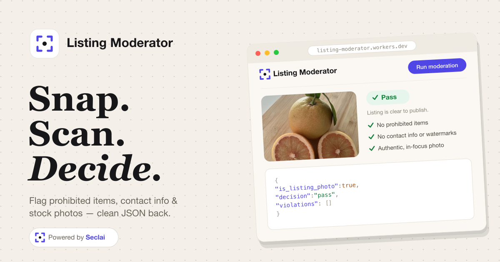

<div align="center">
  <h1>Listing Moderator</h1>
  <p>Moderate marketplace listing photos with a vision agent. Powered by Seclai.</p>
  <p>
    <a href="https://deploy.workers.cloudflare.com/?url=https://github.com/seclai/demos/tree/main/listing-moderator">
      
    </a>
  </p>
</div>

Drop in a JPG/PNG (and an optional caption) and a [Seclai](https://seclai.com)
agent returns a strict JSON verdict — approve, review, or reject — with
violations, advisory flags, a quality score, and confidence.

## Tech Stack

- **Astro 6** (`output: 'server'`, Cloudflare adapter) — keeps the Seclai API key
  server-side and ships the whole SSR app as one Cloudflare Worker.
- **React 19** island for the interactive form/result UI.
- **`@seclai/sdk`** for the upload → run → poll flow.
- **Cloudflare Workers** for deploy.

## How it works

1. The browser POSTs `image` + optional `caption` to [src/pages/api/moderate.ts](src/pages/api/moderate.ts).
2. The route calls `moderateListing()` in [src/lib/moderation.ts](src/lib/moderation.ts), which hands the image (and caption) to the Seclai agent via [src/lib/seclai.ts](src/lib/seclai.ts). (The moderator prompt lives on the agent's `system_template`, not the runtime input — long prompts sent as input trip Seclai's prompt-injection scanner.)
3. The vision agent returns a JSON blob; we parse it tolerantly and **compute the verdict in code** from the violations rather than trusting the model's own verdict.
4. [src/components/ListingModerator.tsx](src/components/ListingModerator.tsx) renders the result as a card or raw JSON.

## Cloning & running

1. Fork or clone the repo.
2. Run `npm install` (Node 20+, 22 recommended).
3. Import a Seclai agent from [`agents/`](agents/) and copy its ID. Start with
   [`marketplace-listing-moderator.development.json`](agents/marketplace-listing-moderator.development.json)
   (Seclai dashboard → **Agents → Import**); a
   [production](agents/marketplace-listing-moderator.production.json) export is
   there too.
4. Create a Seclai API key (**Account Settings → API Keys → Create** — shown once).
5. Run `cp .env.example .env.local` and fill in `SECLAI_API_KEY` and
   `SECLAI_AGENT_ID` (`SECLAI_BASE_URL` is optional).
6. Run `npm run dev` and open the printed URL (typically `http://localhost:4321`),
   drop in a listing photo, and click **Run moderation**.

## Deploy to Cloudflare

The whole SSR app ships as a single [Cloudflare Worker](https://workers.cloudflare.com)
via [`@astrojs/cloudflare`](https://docs.astro.build/en/guides/integrations-guide/cloudflare/).

### Option A — one-click

[](https://deploy.workers.cloudflare.com/?url=https://github.com/seclai/demos/tree/main/listing-moderator)

Cloudflare clones this subdirectory into a new repo under your GitHub account,
runs `npm run build`, provisions the Worker, and creates the `SESSION` KV
namespace. It can't bake in secrets, so afterward:

1. In the new Worker → **Settings → Variables and Secrets**, add `SECLAI_API_KEY`
   and `SECLAI_AGENT_ID` (use your **production** agent id).
2. Redeploy (**Deployments → Retry**, or `wrangler deploy`) so the Worker picks
   up the secrets.

### Option B — Wrangler CLI

```bash
npm install -g wrangler
wrangler login
wrangler secret put SECLAI_API_KEY      # paste the key
wrangler secret put SECLAI_AGENT_ID     # paste the production agent id
npm run build && wrangler deploy
```

The first deploy prompts to create the `SESSION` KV namespace — accept it.
To update later, re-run `npm run build && wrangler deploy`.

## Customizing the agent

The agent's workflow lives in the JSON files in [agents/](agents/). The moderator
prompt + JSON schema is the `prompt_call` step's **`system_template`** (mirrored in
[src/lib/moderation.ts](src/lib/moderation.ts) as `MODERATOR_SYSTEM_PROMPT` — keep
the two in sync). It **must** stay on `system_template`, not the runtime `input`,
or Seclai's prompt-injection scanner flags it. Set `model` to any vision-capable
model. After editing in the dashboard, re-export and overwrite the JSON so the
repo stays in sync.

## Troubleshooting

- **`SECLAI_API_KEY is not set`** — fill it into `.env.local` and restart the dev server.
- **`Seclai run failed … input_scan=unsafe`** — the prompt-injection scanner flagged
  the runtime `input`. The moderator prompt must live in the agent's
  `system_template`; only the short seller caption should be sent as `input`.
- **`Seclai run failed` / empty output** — confirm the agent's `prompt_call` step is
  on a vision-capable model and the image is reaching the agent (check the run in
  the Seclai dashboard).
- **`That doesn't look like a listing photo`** — the agent flagged
  `is_listing_photo: false`. Try a clearer product shot.
- **403 from `curl`** — add `-H "Origin: $O"` matching the dev URL (Astro CSRF).
